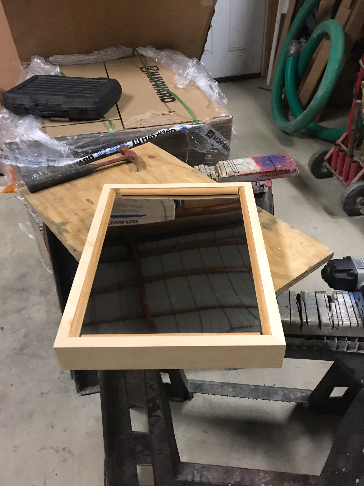

# Building The Frame

Materials-  nails, trimming, a six foot plank of pine wood, an acrylic mirror, and a computer monitor.

Take the screen you will be using for this project, and take of the shell. This can be done with a little time and a decent flathead screwdriver to slowly peel the outer shell away from the metal interior. Once this is done, measure the screen and the mirror.

With proper tools and knowledge, it is a very simple procedure
measure the computer monitor width and height and then do the same to the mirror. Then cut the wood to build a box around the two largest measurements. Proceed to fixed them in place with nails and then apply the trimming to both the front and back of the frame to hold in the screen and mirror from falling out of the frame. Secure the frame pieces with nails to fully secure the magic mirror.

If you so desire, you can stain all the wood before finalizing it all with nails, giving it a more unique look than plan pine as seen above.

This is the code for the webserver portion.
