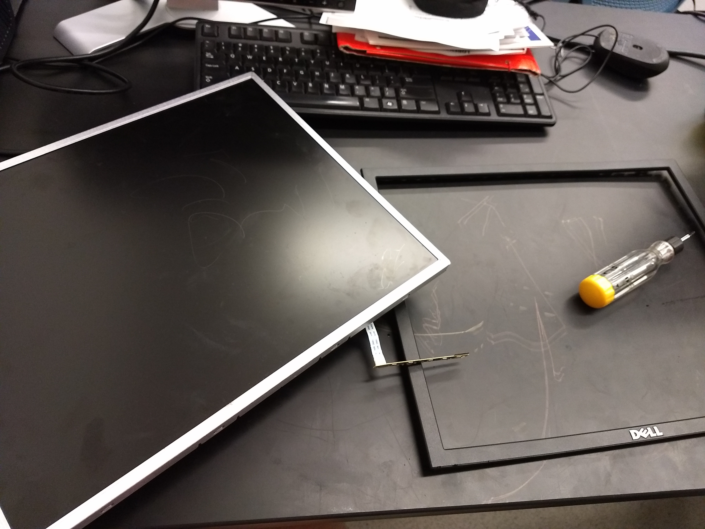
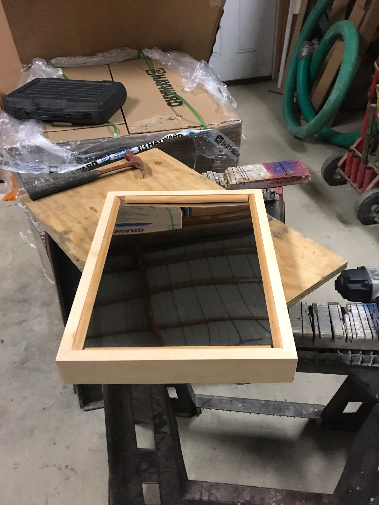

# Magic_Mirror

**Goal:**
We will be building a smart mirror utilizing the raspberry pi that can give the user a welcome message, display the current date and time, and forecast for the day. The smart display will turn on when the user walks in front of the mirror, using a motion detection sensor. 

**Technologies:**
We intend to use a mirror for the screen with a similarly sized screen behind it to show through the mirror on the other side. For the programming languages we will use Python and Bash scripting. For the weather and time, we will have the mirror connected to the internet and simply have the weather and clock boot up in the corners of the screen.

**Bill of Materials:**
A one way mirror (12x24), flat computer screen (similar size to one way mirror), wiring, power cable, motion detector, raspberry pi, nails, trimming, a six foot plank of pine wood.

**Instructions for installation and code into Command Line:**
>$ git clone https://github.com/N03265566/Magic_Mirror

change directory into /code folder

*//install pip*
>$ sudo apt-get install python-pip

*//install packages in requirements.txt*
>$ sudo pip install -r requirements.txt

*//install python TKinter*
>$ sudo apt-get install python-imaging-tk

*//install beautiful soup*
>$ sudo apt-get install python-bs4
OR
>$ sudo pip install beautifulsoup4

**Instructions for building frame:**

Take the screen you will be using for this project, and take of the shell. This can be done with a little time and a decent flathead screwdriver to slowly peel the outer shell away from the metal interior. Once this is done, measure the screen and the mirror.

With proper tools and knowledge, it is a very simple procedure
Measure the computer monitor width and height and then do the same to the mirror. Then cut the wood to build a box around the two largest measurements. Proceed to fixed them in place with nails and then apply the trimming to both the front and back of the frame to hold in the screen and mirror from falling out of the frame. Secure the frame pieces with nails to fully secure the magic mirror.

If you so desire, you can stain all the wood before finalizing it all with nails, giving it a more unique look than plain pine as seen above.

**Running the Script**
Utilizing Python's standard GUI, TKinter, we will be able to display the smart mirror objects to the monitor screen from the Pi.
Run the program with the following code:
>$ python smart_mirror.py
